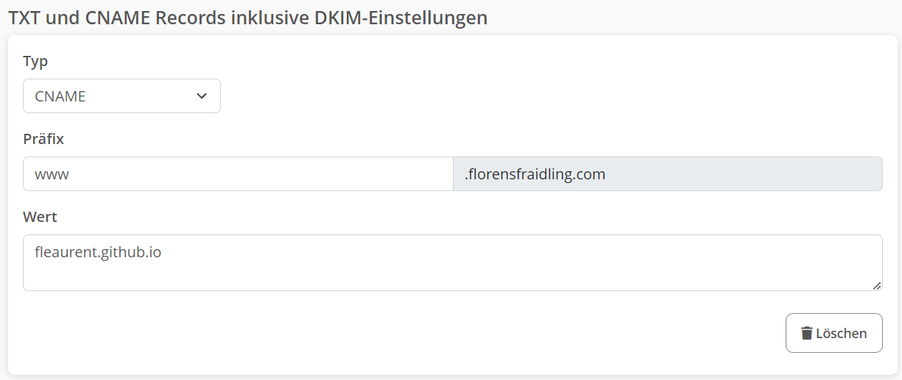
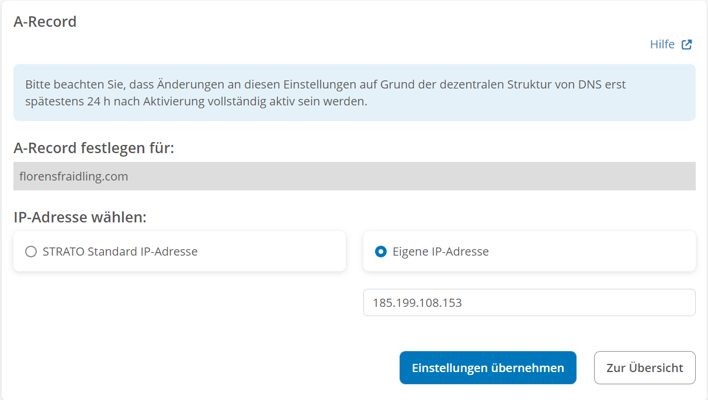
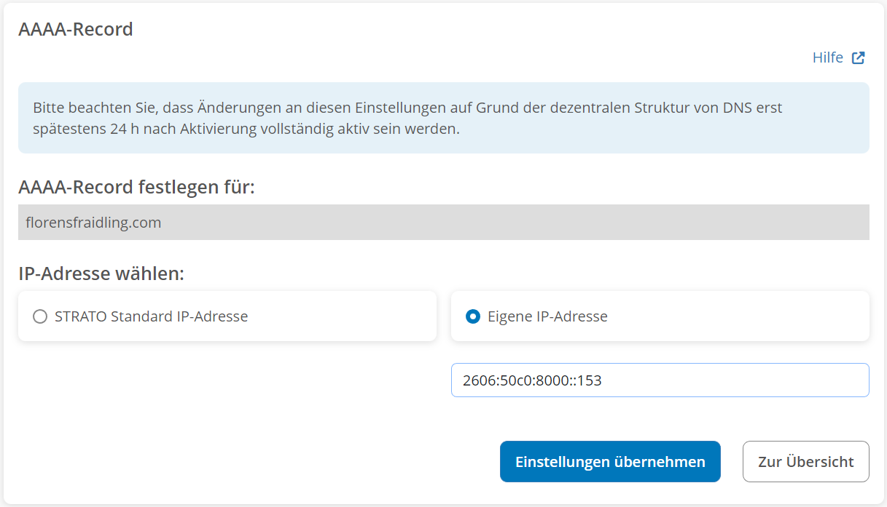

# Github Pages

https://github.com/pages-themes/midnight  

ToDo: https://github.com/fastai/fastpages  

## Custom Domain

https://docs.github.com/en/pages/configuring-a-custom-domain-for-your-github-pages-site/managing-a-custom-domain-for-your-github-pages-site  

1. Setup custom domain in the settings of the repository.  
  i.e. map username.github.io to example.com.
2. Create a CNAME record mapping www.example.com to username.github.io.  
     

3. Create an A record mapping example.com to the IPv4 addresses of the GitHub Pages servers:  
   `A records`  

   ```bash
   185.199.108.153
   185.199.109.153
   185.199.110.153
   185.199.111.153
   ```

   Problem: only one A record is allowed -> no dns round robin  
     

4. Create an AAAA record mapping example.com to the IPv6 addresses of the GitHub Pages servers.  
   `AAAA records`  

   ```bash
   2606:50c0:8000::153
   2606:50c0:8001::153
   2606:50c0:8002::153
   2606:50c0:8003::153
   ```

   Problem: only one AAAA record is allowed -> no dns round robin
   
