# Master Thesis
**2019, 4. Semester, Master Electrical Engineering:**  

Masterarbeit bei Fraunhofer-Einrichtung für Mikrosysteme und Festkörper-Technologien EMFT  

  

---
**Aufgabengebiet:**  

&rarr; Machine Learning, Deep Learning, Anomaly Detection  

  

---
**Kurzfassung: Anomalie Erkennung in Zeitreihendaten
mit Neuronalen Netzen**  

Für die Umsetzung der Präventiven Wartung in Produktionsumgebungen erweitert diese
Arbeit einen Ansatz zur Erkennung von Anomalien, dessen Leistungsfähigkeit durch die
Anwendung von Zeitreihendaten unterschiedlich komplexer Prozesse ausgewertet wird.  

Sensordaten verschiedenster Prozessparameter sind in zunehmender Menge verfügbar.
Für die Verarbeitung großer Datenmengen ist die Anwendung Maschineller Lernverfahren
Stand der Technik. Fehlende Informationen über alle potentiellen Fehlerbildern der
Prozessdaten schränken die Auswahl geeigneter Verfahren ein.  

Das Anomalie Erkennungsverfahren lernt anhand Zeitreihendaten erfolgreich
abgelaufener Prozesse den normalen Prozessablauf. Autoencoder, speziell angepasste
Strukturen neuronaler Netze, lernen diese Trainingsdaten zu rekonstruieren. Die
optimierte Rekonstruktionsfähigkeit normaler Prozessabläufe ist Grundlage für die
Erkennung abweichender Prozesse. Statistische Verfahren, basierend auf der
Rekonstruktionsfehler Verteilung normaler und anormaler Validierungsdaten, werden zur
weiteren Optimierung der Anomalie Erkennung verwendet.  

Die Anwendung dieses erweiterten Ansatzes erfolgt an unterschiedlichen Datensätzen.
Der Ablauf umfasst die Datenvorverarbeitung, Modellentwurf, Modelltraining und die
Auswertung und Optimierung der Anomalie Erkennung.  

Die verwendeten Datensätze bestätigten die praktische Anwendbarkeit des erweiterten
Anomalie Erkennungsverfahren. Komplexere Prozessdaten zeigen allerdings die Grenzen
einfacher Autoencoder Modelle auf.  

---
**Abstract: Anomaly Detection in Time Series Data
with Neural Networks**  
For the implementation of preventive maintenance in production environments, this
thesis extends an anomaly detection approach whose performance is evaluated using
time series data from processes of different complexity.  

Sensor data of a wide range of process parameters are becoming increasingly available.
For the processing of large amounts of data, the application of machine learning methods
is state of the art. The absence of information about all potential error patterns of the
process data limits the choice of compatible methods.  

The anomaly detection method learns the normal process cycles from the time series data
of successfully completed processes. Autoencoders, adapted structures of neural
networks, learn to reconstruct these training data. The optimized reconstruction
capability of normal processes is essential for the detection of deviating processes.
Statistical methods, based on the reconstruction error distribution of normal and
anomalous validation data, are used to further optimize the anomaly detection
performance.  

This extended approach is applied against different datasets. The procedure comprises
data preprocessing, model design, model training and the evaluation and optimization of
the anomaly detection performance.  

The applied datasets confirm the practical applicability of the extended anomaly
detection procedure. However, more complex process data reveal the limitations of
simple autoencoder models.  

---
**Inhalt:**  
Preventive Maintenance
(PvM):  
Maintenance activities are only to be performed when actually needed. Unexpected breaks and unexploited equipment lifetime are minimized
simultaneously  
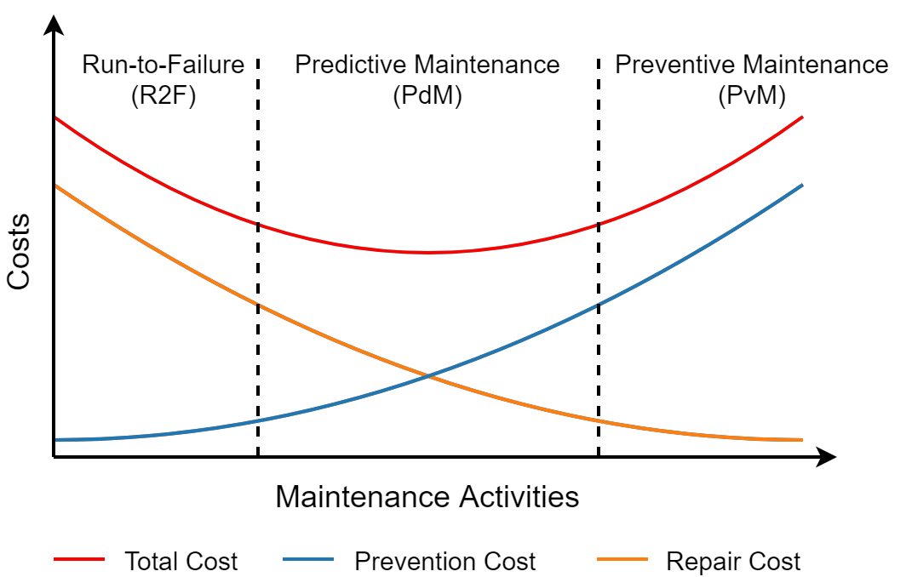  

Anomaly Detection is the problem of finding patterns in data that do not follow the
expected behavior. Anomalies are unusual data instances that should be further analyzed
to identify the cause of its occurrence.  
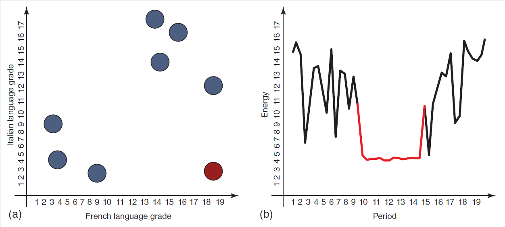  

Time Series Data in production environments, is data from sensors sampled in a sequential order and usually recorded at regular intervals.  
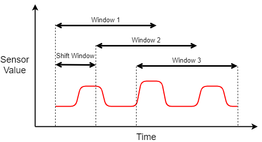  

Autoencoders are feedforward networks with sequential layers of neuronal units. The
input data is to be reconstructed at the output layer. The information exchange is
constrained by the specific network architecture.  By using only unlabeled data,
autoencoders learn the encoding of information independently. Hence, they are
considered an unsupervised learning approach.  
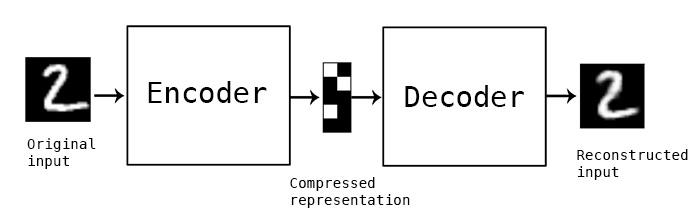  

time series anomaly detection:  
an
anomaly classifier is defined using statistical methods based on the reconstruction
performance of the trained autoencoder model  
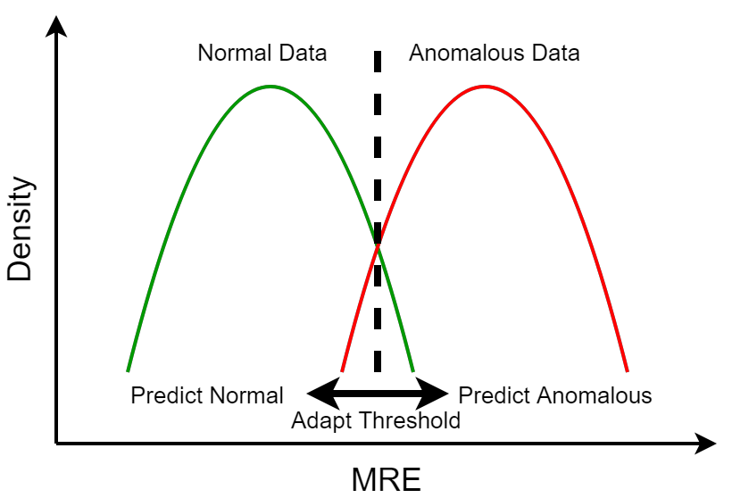  
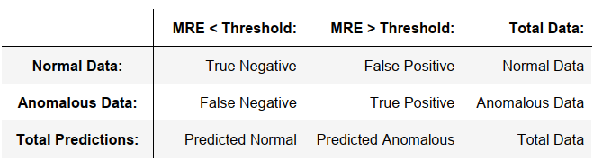  

The trained autoencoder model is evaluated according to its reconstruction performance based on normal and anomalous input data  
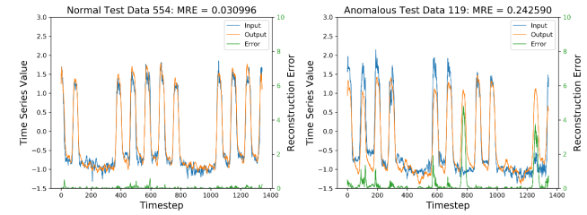  
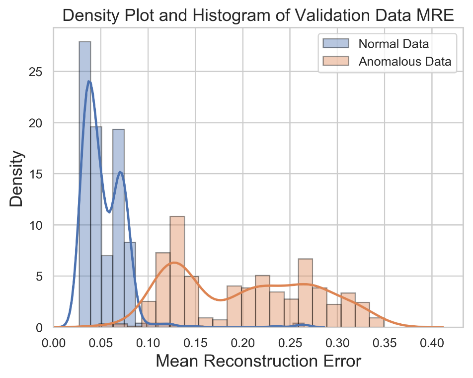  
&rarr; The determined optimum F-Beta threshold is applied to classify normal and anomalous
validation data  
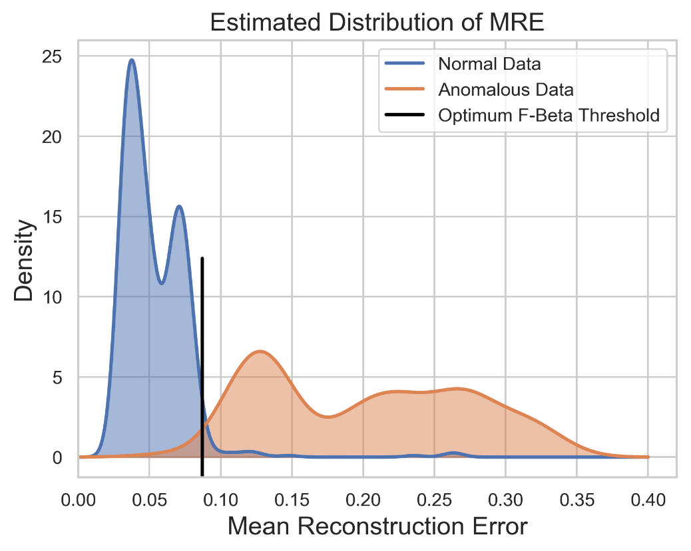  
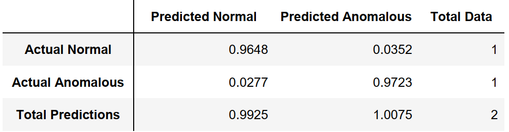  
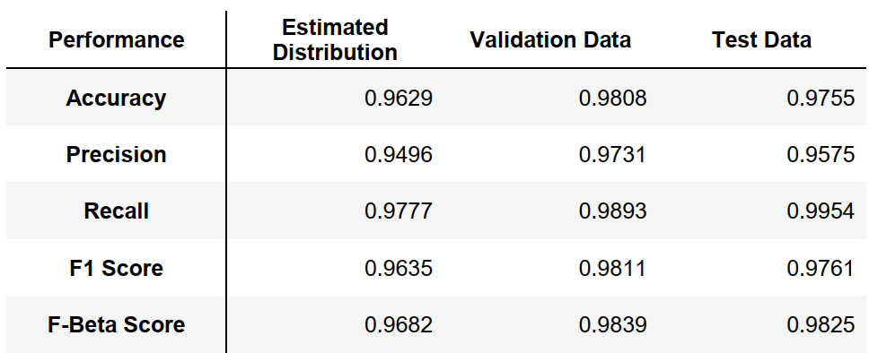  

---
[back](./)