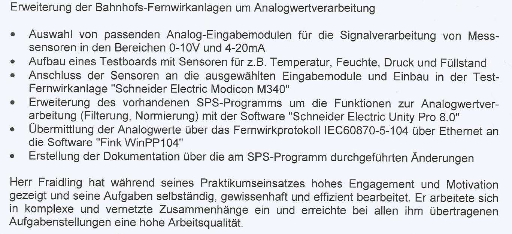

# 2016 Bachelor Electrical Engineering: Practical Semester

[@Stadtwerke München GmbH](https://www.swm.de/)  
  

___

## Analog Value Processing at Remote Stations  

Praxissemester "Analogwertverarbeitung an Fernwirkunterstationen" im Bereich Verkehrstelematik im Unternehmsbereich Verkehr der Stadtwerke München GmbH  
&rarr; PLC IEC 61131-3 programming  

  

___

[back](./)