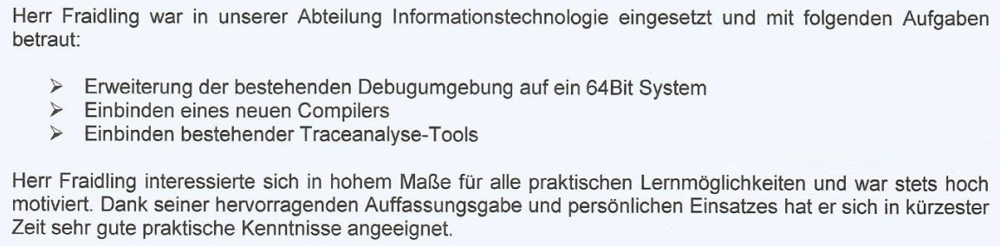

# 2017 Bachelor Electrical Engineering: Bachelor Thesis  

[@Volke Consulting Engineers GmbH & Co. Planungs KG](https://www.volke-muc.de/)  
  

- [1. Topic: "Update of the Debug Environment for APIX-Driver"](#1-topic-update-of-the-debug-environment-for-apix-driver)
- [2. Abstract](#2-abstract)
- [3. Reference](#3-reference)

___

## 1. Topic: "Update of the Debug Environment for APIX-Driver"  

Embedded Software and Hardware Development for the Automotive Industry  

___

## 2. Abstract

The current debug environment of the display (APIX) driver differs significantly from the
HeadUnit 2018 system. The components are out of date and meet no longer today's
requirements. Due to this situation no adequate technical certification tests of the driver
and display analyzes are possible.  

The debug environment of the display drivers is to be
rebuild and extended, to simulate a HeadUnit (base HU 2018). This includes the
transmission of management and video data from a microcontroller via the APIX interface
to the displays. For this purpose the previously used debug environment is described and
analyzed, alternative hardware is evaluated according to the requirements.  

With the newly established development environment, drivers for the communication
interfaces of the new microcontroller are described. These will attend as a basis for
further software implementation of the updated debug environment.  

The result of this Bachelor thesis is to build up the hardware and to develop basic software
for an updated test station of the APIX drivers.  

___

## 3. Reference

  

___

[back](./)
