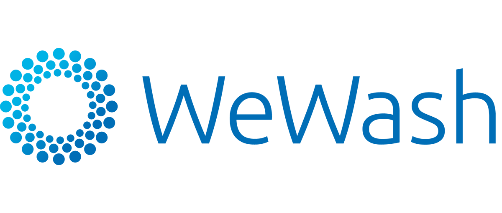
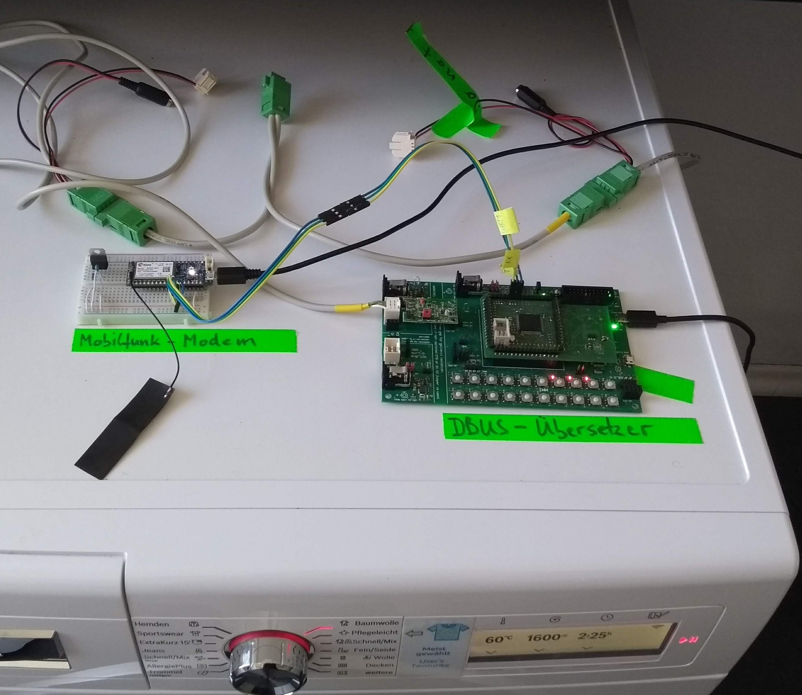
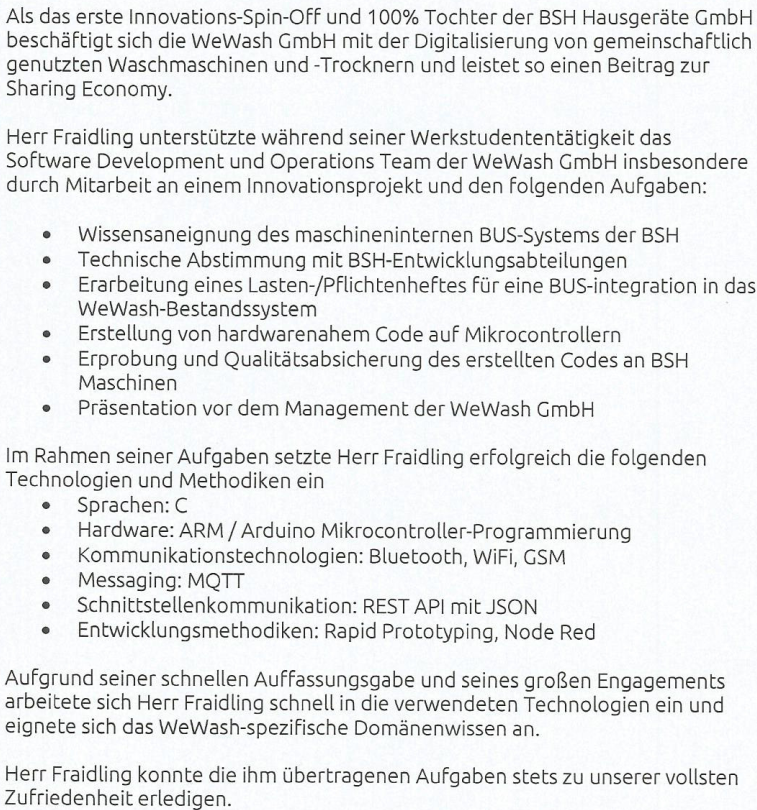

# 2018 Master Electrical Engineering: Working Student

[@WeWash GmbH](https://www.wewash.de/)
  

Working student at WeWash GmbH, a subsidiary of BSH Hausgeräte GmbH

- [1. Content](#1-content)
- [2. Reference](#2-reference)

___

## 1. Content

Embedded Software Development for Home Appliances:  
Communication on the BSH communication bus "DBUS-II" via GSM data connection using Cellular IOT Boards  
  

___

## 2. Reference

  

___

[back](./)
